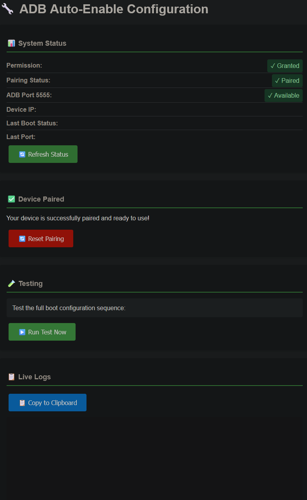

# 🔧 adb-auto-enable

**Automatically enable wireless ADB debugging and switch to port 5555 on every boot - completely autonomous, no root required!**

Perfect for Chromecast with Google TV, Android TV boxes, and any Android device where you want persistent wireless ADB access without manual intervention.

**I am not a programmer. This was coded using AI. It works for me and I'm sharing it in the hopes it may be of use, or inspire someone else. Please do not expect much in the way of maintenance or support, I made this purely for my own use.**

> [!WARNING]
> **SECURITY WARNING:** This application enables Android Debug Bridge (ADB) on port 5555, which provides remote access to your device with full system privileges. While ADB connections require RSA key authentication (users must accept the connection on first pairing), **once a computer is authorized, it has permanent unrestricted access** to install applications, access all data, execute shell commands, and take complete control of your device without further prompts. Additionally, the RSA authentication prompt is vulnerable to overlay attacks where malicious apps can trick users into authorizing connections. **This app should ONLY be used on isolated or trusted networks** (such as a home network behind a firewall with no port forwarding) and **NEVER on public WiFi, guest networks, or any network you do not fully control**. Exposing ADB to the internet or untrusted networks can result in complete device compromise if an attacker gains authorization, either through social engineering, overlay attacks, or physical access to previously paired computers. Use this tool only on devices you own and ensure your network is properly secured with a firewall blocking external access to port 5555.

<p align="center">
  
</p>

## 🚫 Limitations

- Tested only on CCwGTV. May not work at all on wired devices.

## ✨ Features

- 🚀 **Fully Autonomous**: Automatically enables wireless debugging and switches to port 5555 on every boot
- 📱 **No Root Required**: Works on non-rooted devices with a one-time pairing via the web UI
- 🌐 **Web UI**: Clean web interface at `http://device-ip:9093` for status, pairing, and live logs
- 🔄 **Smart Retry**: Implements retry logic with WiFi connection monitoring for reliability
- 🔐 **Auto-Permission Grant**: Automatically grants itself WRITE_SECURE_SETTINGS after pairing (no PC required!)
- 📋 **Live Logs**: View real-time logs directly in the web interface with copy-to-clipboard functionality
- 🛡️ **Background Persistence**: Web server runs in a foreground service, survives app backgrounding

## 🎬 How It Works

1. **One-Time Pairing**: App pairs with itself via localhost, storing authentication keys
2. **Auto-Grant Permission**: After pairing, app automatically grants itself WRITE_SECURE_SETTINGS permission via ADB
3. **Boot Detection**: On device boot, service starts automatically (with WiFi monitoring and 60s stabilization delay)
4. **Enable Wireless Debugging**: Enables wireless debugging via `Settings.Global`
5. **Port Discovery**: Discovers the random ADB port using mDNS or port scanning
6. **Self-Connection**: Connects to local ADB daemon using stored authentication keys
7. **Port Switch**: Sends `tcpip:5555` command to ADB daemon to switch to fixed port
8. **Done!**: ADB is now available on port 5555 for external connections - completely autonomous!

## 📋 Requirements

- Android 13+ (tested on Chromecast with Google TV)
- WiFi connection
- No PC or ADB required after initial APK installation!

## 🚀 Quick Start

### 1. Installation

Download and install the APK from [Releases](https://github.com/yourusername/adb-auto-enable/releases), or build from source:

```bash
git clone https://github.com/mouldybread/adb-auto-enable.git
cd adb-auto-enable
./gradlew assembleRelease
adb install app/build/outputs/apk/release/app-release.apk
```

### 2. Initial Pairing (No PC Required!)

1. Open the app or navigate to `http://your-device-ip:9093` in a browser
2. On your Android device:
   - Go to **Settings → Developer Options → Wireless Debugging**
   - Tap **"Pair device with pairing code"**
3. Enter the **pairing code** and **pairing port** into the web interface
4. Click **"Pair Device"**
5. The app will automatically attempt to grant itself permissions!

### 3. Verify Setup

1. Check the web UI status - Permission should show "✓ Granted"
2. Click **"Switch to Port 5555 Now"** to test the configuration
3. Check "ADB Port 5555" status - should show "✓ Available"

### 4. Test Auto-Boot

Reboot your device:

```bash
adb reboot
```

Wait about 90 seconds (60s boot delay + 30s for configuration), then connect:

```bash
adb connect your-device-ip:5555
```

## 🌐 Web Interface

Access the web interface at `http://device-ip:9093` to:

- ✅ View system status (permissions, pairing, port availability)
- 🔗 Perform one-time pairing (no PC required!)
- 🔄 Manually trigger port switch
- 🧪 Test the boot configuration sequence
- 📋 View live logs with auto-refresh and copy-to-clipboard
- 📊 Monitor last boot status and discovered ports

## 🛠️ Configuration

### Adjust Boot Delay

Edit `AdbConfigService.java`:

```java
private static final int INITIAL_BOOT_DELAY_SECONDS = 60; // Adjust as needed
```

### Adjust Retry Settings

```java
private static final int MAX_RETRY_ATTEMPTS = 3;
private static final int RETRY_DELAY_SECONDS = 15;
```

### Change Web Server Port

Edit `AdbConfigService.java` and `MainActivity.java`:

```java
private static final int WEB_SERVER_PORT = 9093; // Change port
```

## 🐛 Troubleshooting

### Permission Not Granted / Auto-Grant Failed

If auto-grant fails, you can manually grant the permission from a computer:

**1. Verify Permission Status:**

```bash
adb shell dumpsys package com.tpn.adbautoenable | grep WRITE_SECURE_SETTINGS
```

You should see:
```
android.permission.WRITE_SECURE_SETTINGS: granted=true
```

**2. Manual Permission Grant:**

If permission is not granted, connect via USB and run:

```bash
adb shell pm grant com.tpn.adbautoenable android.permission.WRITE_SECURE_SETTINGS
```

**3. Common Issues:**

**Issue: Permission Monitoring Blocked the Grant** (OnePlus, ColorOS, Xiaomi devices)

On your Android device:
1. Go to **Settings → Developer Options**
2. Find **"Disable Permission Monitoring"** and enable it
3. Toggle **USB Debugging OFF and back ON**
4. Try pairing again in the web UI

**Issue: App Was Running When Permission Was Granted**

```bash
adb shell am force-stop com.tpn.adbautoenable
adb shell pm grant com.tpn.adbautoenable android.permission.WRITE_SECURE_SETTINGS
```

**Issue: Permission State Is "Stuck"**

```bash
adb shell cmd appops reset com.tpn.adbautoenable
adb shell pm grant com.tpn.adbautoenable android.permission.WRITE_SECURE_SETTINGS
```

### Boot Configuration Not Running

Check logs in the web UI at `http://device-ip:9093` or via ADB:

```bash
adb logcat -s ADBAutoEnable
```

Look for:
- `"Boot event detected, starting ADB configuration service..."`
- `"Waiting for WiFi connection..."`
- `"Successfully configured ADB on port 5555!"`

### Port Switch Fails

1. Verify permission is granted (see above)
2. Check pairing status in web UI - must show "✓ Paired"
3. Try manual trigger via web UI button
4. Check live logs in web UI for detailed error messages

### WiFi Takes Too Long to Connect

Increase the WiFi wait timeout in `AdbConfigService.java`:

```java
int maxWaitSeconds = 120; // Increase to 180 or more
```

### Service Crashes on Boot

Check for foreground service permission errors:
```bash
adb logcat | grep -i "foreground"
```

Ensure `AndroidManifest.xml` has:
```xml
<uses-permission android:name="android.permission.FOREGROUND_SERVICE_DATA_SYNC" />
```

### Web Server Not Accessible

The web server runs on port 9093 in a foreground service. If you can't access it:

1. Check that the service is running:
   ```bash
   adb shell dumpsys activity services | grep AdbConfigService
   ```

2. Verify the device IP address in the app's main screen

3. Try accessing from the same network: `http://device-ip:9093`

## 📁 Project Structure

```
adb-auto-enable/
├── app/src/main/java/com/tpn/adbautoenable/
│   ├── MainActivity.java          # Main activity that starts the service
│   ├── AdbConfigService.java      # Foreground service with web server
│   ├── BootReceiver.java          # Boot broadcast receiver
│   ├── AdbHelper.java             # ADB protocol implementation
│   └── WebServer.java             # NanoHTTPD web interface with live logs
├── app/src/main/AndroidManifest.xml
└── README.md
```

## 🔧 Technical Details

### ADB Protocol Implementation

The app implements the ADB wire protocol:
- **CONNECT** message with `host::features` service
- **AUTH** signature/token exchange for authentication
- **OPEN** service channel to ADB daemon
- **WRITE** commands like `tcpip:5555` and `pm grant`

Authentication keys are stored in `/data/data/com.tpn.adbautoenable/files/adb_keys/`.

### Boot Process Flow

```
LOCKED_BOOT_COMPLETED → BootReceiver → AdbConfigService (Foreground)
  ↓
Start Web Server (port 9093)
  ↓
Wait for WiFi (up to 2 min)
  ↓
Wait for system stabilization (60s)
  ↓
Enable wireless debugging
  ↓
Wait 10s for ADB daemon
  ↓
Discover port (mDNS → fallback to scan)
  ↓
Connect to local ADB
  ↓
Send tcpip:5555 command
  ↓
Success! (with 3 retry attempts if needed)
```

### Self-Grant Process

```
User Pairs via Web UI (localhost:random-port)
  ↓
Pairing successful, keys stored
  ↓
App discovers current ADB port (mDNS/scan)
  ↓
App connects to localhost:discovered-port
  ↓
App executes: shell:pm grant com.tpn.adbautoenable android.permission.WRITE_SECURE_SETTINGS
  ↓
Permission granted autonomously!
```

## 🙏 Acknowledgments

- Google, for forcing my hardware to update consequently creating this mess
- [This Home Assistant Issue](https://github.com/home-assistant/core/issues/148359)
- Inspired by various Tasker projects and Magisk modules
- Uses [NanoHTTPD](https://github.com/NanoHttpd/nanohttpd) for embedded web server
- Uses [libadb-android](https://github.com/MuntashirAkon/libadb-android) for ADB protocol implementation

## ⚠️ Disclaimer

This app modifies system settings and enables wireless ADB debugging. Only use on devices you own and control. Enabling wireless ADB debugging can pose security risks if not properly secured on your network.
