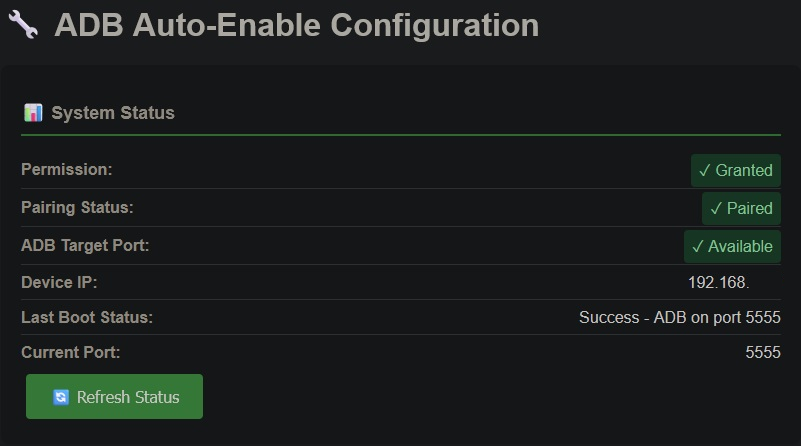

# 🔧 adb-auto-enable

**Automatically enable wireless ADB debugging and switch to your chosen port (default 5555) on every boot, no root required!**

Android 14 introduces enhanced ADB security which disables and randomises the port used after sleep/reboot, breaking automation setups. Auto ADB Enable automatically re-enables wireless ADB, maintaining remote access for non-interactive devices.

Developed on a Chromecast with Google TV (CCwGTV), results may vary on other hardware. Only works with WiFi - not Ethernet.


##  How It Works

1. **One-Time Pairing**: App pairs with itself via localhost, storing authentication keys.
2. **Auto-Grant Permission**: After pairing, the app automatically grants itself `WRITE_SECURE_SETTINGS` permission via local ADB.
3. **Immediate Boot Activation**: On device boot, `BootReceiver` instantly launches `AdbConfigService` to satisfy Android 14+ foreground service launch rules.
4. **Early Setting Enforcement**: Instantly writes `adb_wifi_enabled = 1` to `Settings.Global` before any network or sleep delays.
5. **Stabilization & Network Wait**: Service waits for an active Wi-Fi/Ethernet IP and allows a 30-second system stabilization period.
6. **Port Discovery**: Discovers the randomized ADB port using mDNS or a 64-thread parallel socket sweep (`32768–60999`).
7. **Self-Connection & Switch**: Connects to the local ADB daemon (LAN IP $\rightarrow$ loopback fallback) and sends the `tcpip:<target_port>` command.
8. **Done!**: ADB is now locked and available on your target port for external connections!

> [!WARNING]
> **SECURITY WARNING:** This application enables Android Debug Bridge (ADB) on your configured port (default 5555), which provides remote access to your device with full system privileges. While ADB connections require RSA key authentication (users must accept the connection on first pairing), **once a computer is authorized, it has permanent unrestricted access** to install applications, access all data, execute shell commands, and take complete control of your device without further prompts. Additionally, the RSA authentication prompt is vulnerable to overlay attacks where malicious apps can trick users into authorizing connections. **This app should ONLY be used on isolated or trusted networks** (such as a home network behind a firewall with no port forwarding) and **NEVER on public WiFi, guest networks, or any network you do not fully control**. Exposing ADB to the internet or untrusted networks can result in complete device compromise if an attacker gains authorization, either through social engineering, overlay attacks, or physical access to previously paired computers. Use this tool only on devices you own and ensure your network is properly secured with a firewall blocking external access.

<p align="center">
  
</p>

## Quick Start

### Requirements:

- Android 13+ (tested on Chromecast with Google TV and modern Android builds)
- Wi-Fi connection
### 1. Installation

Download and install the APK from [Releases](https://github.com/mouldybread/adb-auto-enable/releases), or build from source:

```bash
git clone [https://github.com/mouldybread/adb-auto-enable.git](https://github.com/mouldybread/adb-auto-enable.git)
cd adb-auto-enable
./gradlew assembleRelease
adb install app/build/outputs/apk/release/app-release.apk
```

### 2. Initial Pairing

1. Navigate to `http://your-device-ip:9093` in a browser.
2. On your Android device:
   - Go to **Settings → Developer Options → Wireless Debugging**
   - Tap **"Pair device with pairing code"**
3. Enter the **pairing code** and **pairing port** into the web interface or app screen.
4. Click **"Pair Device"**.
5. The app will automatically attempt to self-grant required permissions!

### 3. Verify Setup

1. Check the web UI status — Permission should show "✓ Granted".
2. Click **"Switch Target Port Now"** in the web interface to test the configuration manually.
3. Check status — should show "✓ Available".

### 4. Test Auto-Boot

Reboot your device:

```bash
adb reboot
```

Wait about 45–60 seconds (service initialization + 30s system stabilization delay), then connect to your configured port:

```bash
adb connect your-device-ip:5555
```

## Troubleshooting

### Permission Not Granted / Auto-Grant Failed

If auto-grant fails, you can manually grant the permission from a computer:

```bash
adb shell pm grant com.tpn.adbautoenable android.permission.WRITE_SECURE_SETTINGS
```

---

### Boot Configuration Not Running

Check logs in the web UI at `http://device-ip:9093` or via ADB:

```bash
adb logcat -s ADBAutoEnable
```

Look for:
- `"Boot event detected, starting ADB configuration service immediately..."`
- `"Step 0: Immediately enabling wireless debugging setting..."`
- `"Waiting for WiFi connection..."`
- `"Successfully configured ADB on port 5555!"`

---

### Web Server Not Accessible

The web server runs on port 9093 in a foreground service. If you can't access it:

1. Check that the service is running:
   ```bash
   adb shell dumpsys activity services | grep AdbConfigService
   ```
2. Verify the device IP address on the main app screen.
3. Ensure you are accessing from the same network subnet: `http://device-ip:9093`.

---
## Technical Details

###  Project Structure

```text
adb-auto-enable/
├── app/src/main/java/com/tpn/adbautoenable/
│   ├── MainActivity.java          # Activity with Target Port UI controls
│   ├── AdbConfigService.java      # Foreground service executing boot sequence
│   ├── BootReceiver.java          # Instant boot broadcast receiver
│   ├── AdbHelper.java             # Wire protocol implementation & port switcher
│   ├── NetworkUtils.java          # Live IP resolution & connectivity checks
│   └── WebServer.java             # NanoHTTPD web UI with live logs & status
├── app/src/main/AndroidManifest.xml
└── README.md
```

### ADB Protocol Implementation

The app implements the native ADB wire protocol:
- **CONNECT** message with `host::features` service
- **AUTH** signature/token exchange for RSA authentication
- **OPEN** service channel to local ADB daemon
- **WRITE** commands like `tcpip:<port>` and `pm grant`

Authentication keys are generated locally and stored in `/data/data/com.tpn.adbautoenable/files/`.

### Boot Process Flow

```text
LOCKED_BOOT_COMPLETED / BOOT_COMPLETED → BootReceiver
  ↓
Start AdbConfigService Foreground Service (Immediate)
  ↓
Start Web Server (port 9093)
  ↓
Step 0: Write adb_wifi_enabled = 1 immediately
  ↓
Step 1: Wait for WiFi connection (up to 60s)
  ↓
Step 2: Wait for system stabilization (30s)
  ↓
Step 3: Discover randomized ADB port (mDNS → 64-thread socket sweep fallback)
  ↓
Step 4: Connect to ADB daemon (Device LAN IP → 127.0.0.1 fallback)
  ↓
Send tcpip:<target_port> command
  ↓
Success! (with 3 retry attempts if needed)
```

---

## Acknowledgments

- Google, for forcing my hardware to update consequently creating this mess
- [This Home Assistant Issue](https://github.com/home-assistant/core/issues/148359)
- Inspired by various Tasker projects and Magisk modules
- Uses [NanoHTTPD](https://github.com/NanoHttpd/nanohttpd) for embedded web server
- Uses [libadb-android](https://github.com/MuntashirAkon/libadb-android) for ADB protocol implementation
